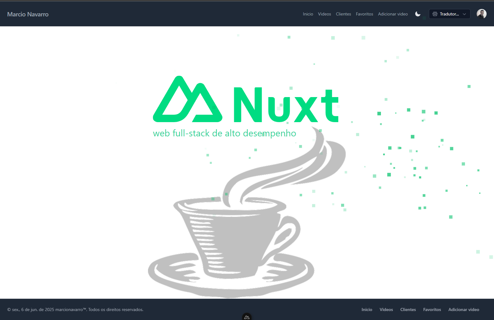
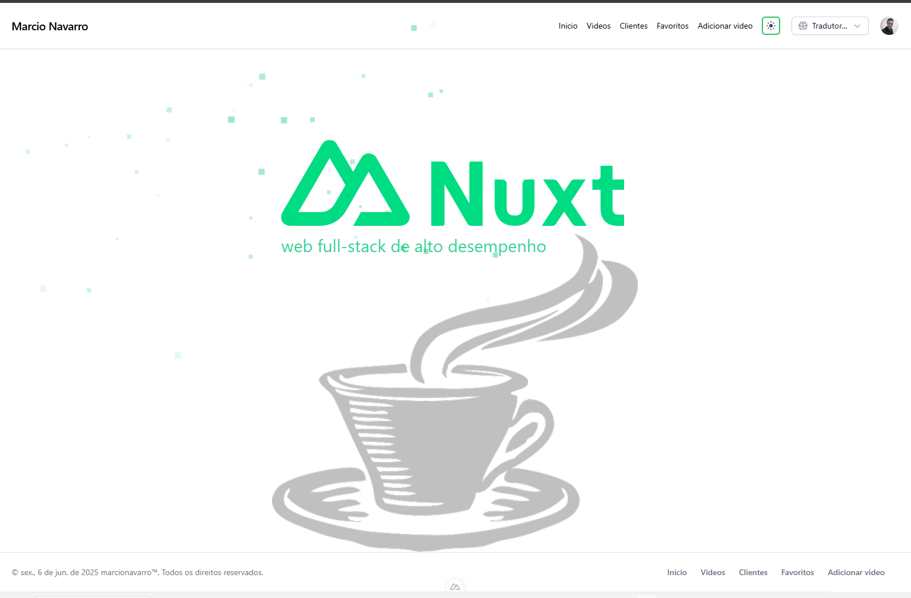
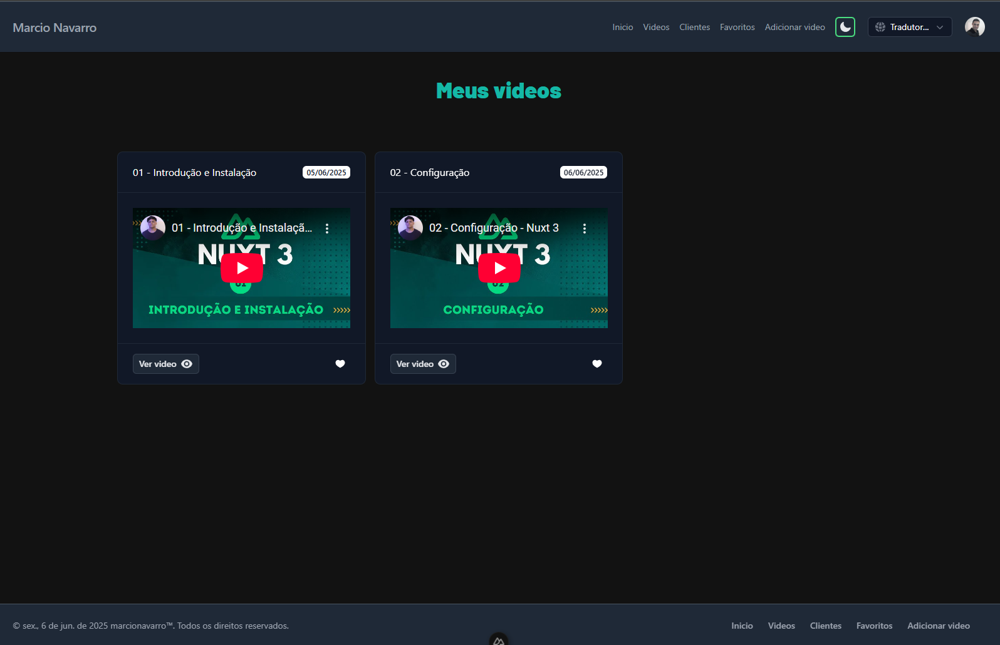
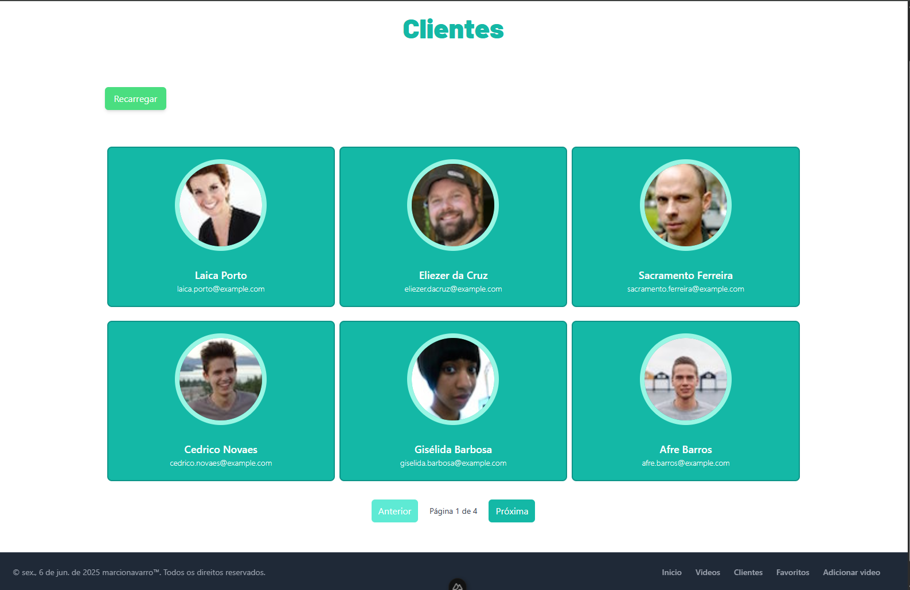
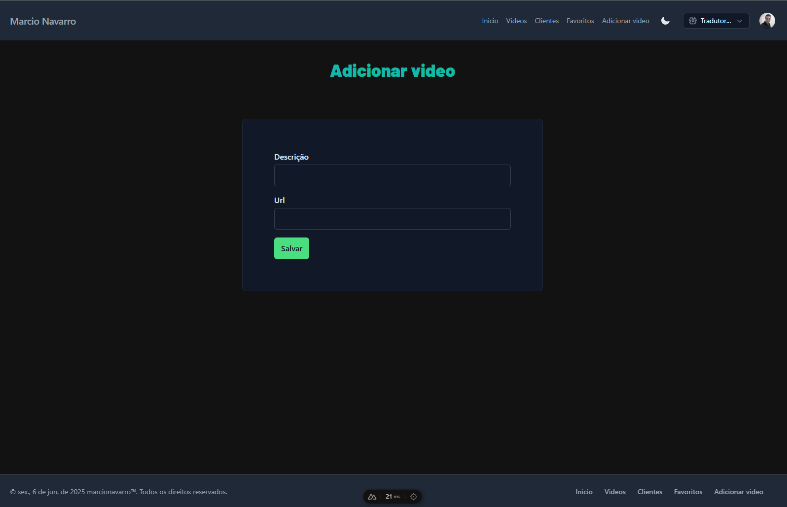
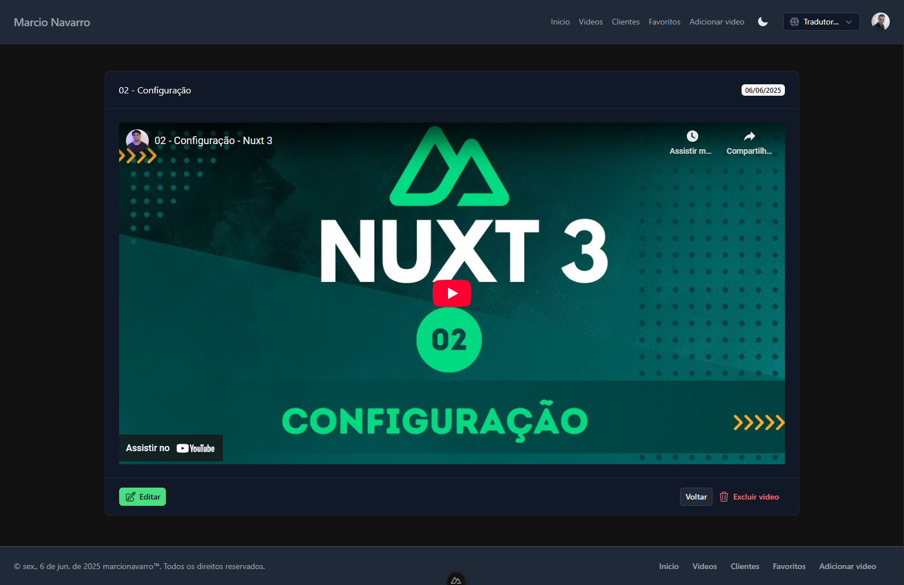
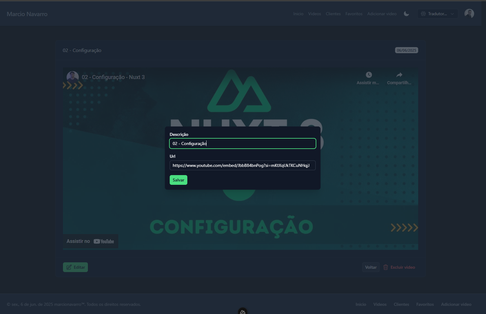
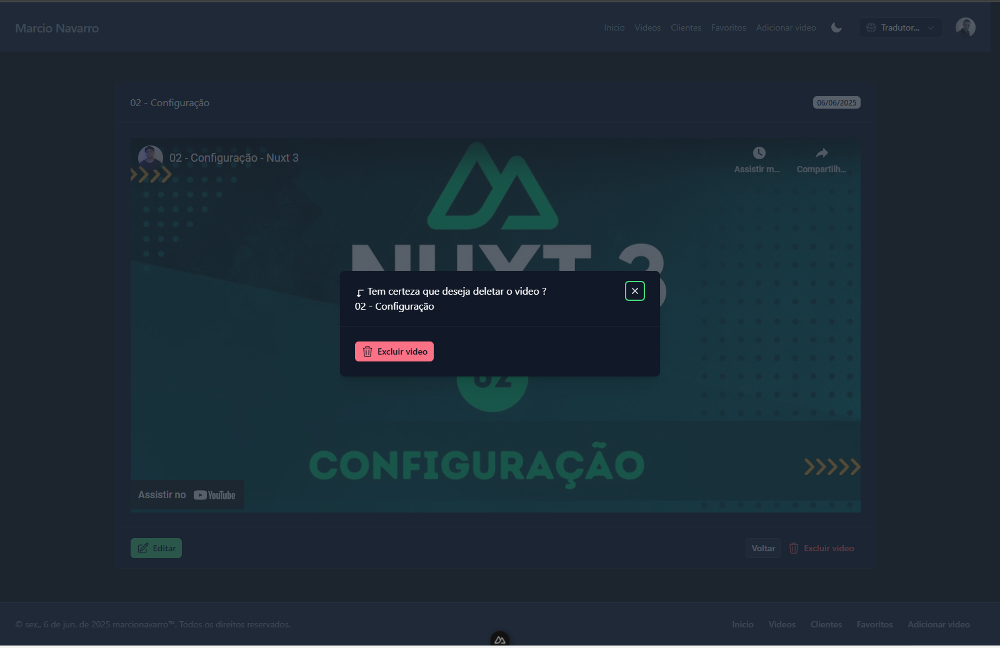

# Nuxt 3 &nbsp;🎬


## ✨ Funcionalidades

- 🔐 **Autenticação OAuth** (Google, Auth0)
- 📺 **Listagem de vídeos** com paginação
- ⭐ **Favoritar vídeos** e gerenciamento local de favoritos
- ➕ **Adicionar, editar e remover vídeos** (CRUD)
- 👤 **Gestão de usuários** com permissões (Administrador, Usuário)
- 🌐 **Internacionalização** (i18n)
- 🎨 **Interface responsiva** com TailwindCSS
- 🗃️ **Integração com banco de dados via Prisma**
- 🐳 **Deploy facilitado com Docker**

## 🛠️ Tecnologias Utilizadas

- [Nuxt 3](https://nuxt.com/)
- [TypeScript](https://www.typescriptlang.org/)
- [TailwindCSS](https://tailwindcss.com/)
- [Prisma ORM](https://www.prisma.io/)
- [PostgreSQL](https://www.postgresql.org/)
- [pgAdmin](https://www.pgadmin.org/)
- [Vue 3](https://vuejs.org/)
- [Docker](https://www.docker.com/)
- [Pinia](https://pinia.vuejs.org/)
- [Vue3 Toastify](https://vue3-toastify.js.org/)

## 🚀 Como rodar o projeto

```bash
# Instale as dependências
npm install
```

## 🐳 Docker

```bash
docker-compose up --build
```

###  Acesse
```bash
localhost:3000
```

### Configurando o servidor no PGAdmin

Após subir os containers com Docker, acesse o PGAdmin pelo navegador http://localhost:16543/. Para conectar ao banco de dados, crie um novo servidor com um nome de sua preferência, mas utilize as seguintes configurações:

- **Host**: `postgres-compose`
- **User**: `admin`
- **Password**: `admin123`
- **Database**: `nuxt_tutorial`
- **Port**: `5432`

Esses valores devem corresponder às variáveis do arquivo .env:

````properties
PG_HOST=postgres-compose
PG_USER=admin
PG_PASSWORD=admin123
PG_DATABASE=nuxt_tutorial
PG_PORT=5432
````

Assim, o PGAdmin conseguirá acessar corretamente o banco de dados do projeto.

> **Atenção:** Após realizar o login no sistema pela primeira vez, acesse novamente o PGAdmin, localize o usuário criado na tabela correspondente e altere o campo `permissaoId` para `1`. Isso é necessário para liberar a permissão de adicionar vídeos pelo painel.


## 📂 Estrutura de Pastas

```
├── app.vue
├── components/
├── composables/
├── interfaces/
├── layouts/
├── middleware/
├── pages/
├── plugins/
├── prisma/
├── public/
├── server/
├── shared/
├── stores/
├── utils/
```

## 📸 Screenshots
<table>
  <tr>
    <td align="center">
      
      <br/>
      <b>Tela principal Dark</b>
    </td>
    <td align="center">
      
      <br/>
      <b>Tela principal Light</b>
    </td>
    <td align="center">
      
      <br/>
      <b>Meus Videos</b>
    </td>
  </tr>
  <tr>
    <td align="center">
      
      <br/>
      <b>Clientes</b>
    </td>
    <td align="center">
      
      <br/>
      <b>Meus Favoritos</b>
    </td>
    <td align="center">
      
      <br/>
      <b>Adicionar Video</b>
    </td>
  </tr>
  <tr>
    <td align="center">
      
      <br/>
      <b>Video</b>
    </td>
    <td align="center">
      
      <br/>
      <b>Editar Video</b>
    </td>
    <td align="center">
      
      <br/>
      <b>Deletar Video</b>
    </td>
  </tr>
</table>

---
Feito com 💚 por [Marcio Navarro](https://marcionavarro.com.br/)  
Tutorial da playlist  Nuxt 3 criada por  [Pablo Cortes](https://www.youtube.com/watch?v=WahQ5AoXpuU&list=PLxd1RHU8YgYmTKohDs2lTqGvy0eaZJFfK)
